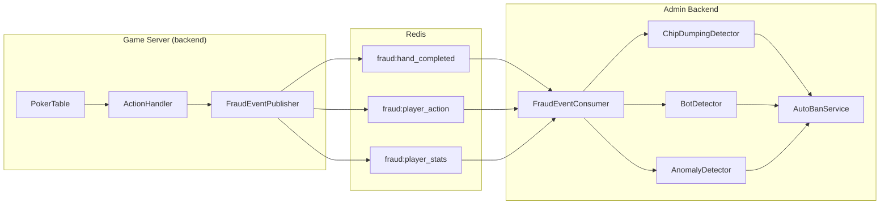

# 설계 문서: 부정 행위 탐지 시스템 통합

## 개요

본 문서는 admin-backend에 구현된 부정 행위 탐지 서비스들을 실제 게임 서버와 통합하는 기술 설계를 정의합니다. Redis Pub/Sub을 통해 게임 이벤트를 실시간으로 전달하고, 기존 탐지 서비스들이 이를 분석하여 자동 제재를 수행합니다.

### 시스템 아키텍처



## 컴포넌트 및 인터페이스

### 1. FraudEventPublisher (Game Server)

게임 서버에서 부정 행위 탐지용 이벤트를 Redis로 발행하는 서비스입니다.

```python
class FraudEventPublisher:
    """부정 행위 탐지용 이벤트 발행 서비스"""
    
    def __init__(self, redis_client: Redis):
        self.redis = redis_client
    
    async def publish_hand_completed(self, hand_result: HandCompletedEvent) -> None:
        """핸드 완료 이벤트 발행"""
        pass
    
    async def publish_player_action(self, action: PlayerActionEvent) -> None:
        """플레이어 액션 이벤트 발행"""
        pass
    
    async def publish_player_stats(self, stats: PlayerStatsEvent) -> None:
        """플레이어 세션 통계 이벤트 발행"""
        pass
```


### 2. FraudEventConsumer (Admin Backend)

Redis 채널을 구독하여 이벤트를 수신하고 탐지 서비스를 호출하는 서비스입니다.

```python
class FraudEventConsumer:
    """부정 행위 이벤트 소비자 서비스"""
    
    def __init__(
        self,
        redis_client: Redis,
        chip_dumping_detector: ChipDumpingDetector,
        bot_detector: BotDetector,
        anomaly_detector: AnomalyDetector,
        auto_ban_service: AutoBanService
    ):
        self.redis = redis_client
        self.chip_dumping = chip_dumping_detector
        self.bot_detector = bot_detector
        self.anomaly_detector = anomaly_detector
        self.auto_ban = auto_ban_service
    
    async def start(self) -> None:
        """이벤트 구독 시작"""
        pass
    
    async def stop(self) -> None:
        """이벤트 구독 중지"""
        pass
    
    async def handle_hand_completed(self, event: dict) -> None:
        """핸드 완료 이벤트 처리"""
        pass
    
    async def handle_player_action(self, event: dict) -> None:
        """플레이어 액션 이벤트 처리"""
        pass
    
    async def handle_player_stats(self, event: dict) -> None:
        """플레이어 통계 이벤트 처리"""
        pass
```

### 3. HandHistoryService (Game Server)

핸드 히스토리를 PostgreSQL에 저장하고 조회하는 서비스입니다.

```python
class HandHistoryService:
    """핸드 히스토리 저장 및 조회 서비스"""
    
    def __init__(self, db: AsyncSession):
        self.db = db
    
    async def save_hand(self, hand_result: dict) -> str:
        """완료된 핸드 저장, hand_id 반환"""
        pass
    
    async def get_user_hands(
        self, 
        user_id: str, 
        limit: int = 50,
        offset: int = 0
    ) -> list[dict]:
        """사용자의 핸드 히스토리 조회"""
        pass
    
    async def get_hand_detail(self, hand_id: str) -> dict | None:
        """핸드 상세 정보 조회 (리플레이용)"""
        pass
```

## 데이터 모델

### Redis 이벤트 스키마

#### HandCompletedEvent
```json
{
    "event_type": "hand_completed",
    "timestamp": "2026-01-16T12:00:00Z",
    "hand_id": "uuid",
    "room_id": "uuid",
    "hand_number": 42,
    "pot_size": 1500,
    "community_cards": ["Ah", "Kd", "Qc", "Js", "Th"],
    "participants": [
        {
            "user_id": "uuid",
            "seat": 0,
            "hole_cards": ["As", "Ad"],
            "bet_amount": 500,
            "won_amount": 1500,
            "final_action": "showdown"
        }
    ]
}
```


#### PlayerActionEvent
```json
{
    "event_type": "player_action",
    "timestamp": "2026-01-16T12:00:00Z",
    "user_id": "uuid",
    "room_id": "uuid",
    "hand_id": "uuid",
    "action_type": "raise",
    "amount": 100,
    "response_time_ms": 2500,
    "turn_start_time": "2026-01-16T11:59:57.500Z"
}
```

#### PlayerStatsEvent
```json
{
    "event_type": "player_stats",
    "timestamp": "2026-01-16T12:00:00Z",
    "user_id": "uuid",
    "room_id": "uuid",
    "session_duration_seconds": 3600,
    "hands_played": 45,
    "total_bet": 15000,
    "total_won": 18000,
    "join_time": "2026-01-16T11:00:00Z",
    "leave_time": "2026-01-16T12:00:00Z"
}
```

### 데이터베이스 모델

기존 `Hand` 및 `HandEvent` 모델을 활용합니다. 추가로 `hand_participants` 테이블을 생성하여 참가자별 상세 정보를 저장합니다.

#### HandParticipant 모델 (신규)
```python
class HandParticipant(Base, UUIDMixin):
    """핸드 참가자 정보"""
    __tablename__ = "hand_participants"
    
    hand_id: Mapped[str]  # FK to hands.id
    user_id: Mapped[str]  # FK to users.id
    seat: Mapped[int]
    hole_cards: Mapped[str | None]  # JSON: ["As", "Ad"]
    bet_amount: Mapped[int]
    won_amount: Mapped[int]
    final_action: Mapped[str]  # fold, showdown, all_in_won, etc.
    created_at: Mapped[datetime]
```

## 정확성 속성 (Correctness Properties)

*정확성 속성은 시스템의 모든 유효한 실행에서 참이어야 하는 특성입니다. 이는 사람이 읽을 수 있는 명세와 기계가 검증할 수 있는 정확성 보장 사이의 다리 역할을 합니다.*


### Property 1: 핸드 완료 이벤트 발행 및 스키마 검증

*For any* 완료된 핸드에 대해, Game_Server가 `fraud:hand_completed` 채널로 이벤트를 발행하면, 해당 이벤트는 hand_id, room_id, participants, pot_size, community_cards, timestamp 필드를 모두 포함해야 한다.

**Validates: Requirements 1.1, 1.2**

### Property 2: 플레이어 액션 이벤트 발행 및 스키마 검증

*For any* 인간 플레이어의 액션에 대해, Game_Server가 `fraud:player_action` 채널로 이벤트를 발행하면, 해당 이벤트는 user_id, room_id, action_type, amount, response_time_ms, timestamp 필드를 모두 포함해야 한다.

**Validates: Requirements 2.1, 2.2**

### Property 3: 봇 플레이어 액션 이벤트 미발행

*For any* 봇 플레이어의 액션에 대해, Game_Server는 `fraud:player_action` 채널로 이벤트를 발행하지 않아야 한다.

**Validates: Requirements 2.4**

### Property 4: 플레이어 통계 이벤트 발행 및 스키마 검증

*For any* 테이블을 떠나는 플레이어에 대해, Game_Server가 `fraud:player_stats` 채널로 이벤트를 발행하면, 해당 이벤트는 user_id, room_id, session_duration_seconds, hands_played, total_bet, total_won, join_time, leave_time 필드를 모두 포함해야 한다.

**Validates: Requirements 3.1, 3.2**

### Property 5: 세션 통계 정확성

*For any* 플레이어 세션에 대해, 발행된 통계 이벤트의 hands_played, total_bet, total_won 값은 해당 세션 동안 실제로 플레이한 핸드들의 합계와 일치해야 한다.

**Validates: Requirements 3.3**

### Property 6: 이벤트 유형별 탐지기 호출

*For any* 수신된 부정 행위 이벤트에 대해, Fraud_Event_Consumer는 이벤트 유형에 따라 적절한 탐지기를 호출해야 한다: hand_completed → ChipDumpingDetector, player_action → BotDetector, player_stats → AnomalyDetector.

**Validates: Requirements 4.2, 4.3, 4.4**

### Property 7: 의심 활동 탐지 시 자동 제재 평가

*For any* 탐지기가 의심 활동을 반환하면, Fraud_Event_Consumer는 AutoBanService.evaluate_user()를 호출해야 한다.

**Validates: Requirements 4.5**

### Property 8: 핸드 히스토리 저장

*For any* 완료된 핸드에 대해, Game_Server는 Hand 레코드와 관련 HandParticipant 레코드를 PostgreSQL에 저장해야 한다.

**Validates: Requirements 5.3**

### Property 9: 탐지 점수 기반 자동 조치

*For any* 부정 행위 탐지 결과에 대해, Auto_Ban_Service는 점수에 따라 적절한 조치를 취해야 한다: 임계값 미만(무시), low(모니터링), medium(경고), high(임시 제재).

**Validates: Requirements 6.1, 6.2**

### Property 10: 자동 제재 감사 로그

*For any* 자동 제재 결정에 대해, Auto_Ban_Service는 해당 결정을 감사 로그에 기록해야 한다.

**Validates: Requirements 6.4**

### Property 11: 자동 제재 시 관리자 알림

*For any* 자동 제재가 적용되면, Admin_Backend는 관리자에게 알림을 전송해야 한다.

**Validates: Requirements 6.3**


## 에러 처리

### Redis 연결 실패
- 이벤트 발행 실패 시 에러를 로깅하고 게임 진행은 계속
- 재연결 로직 구현 (지수 백오프)
- 연결 실패 메트릭 수집

### 이벤트 처리 실패
- 개별 이벤트 처리 실패 시 다른 이벤트에 영향 없음
- 실패한 이벤트는 로깅 후 스킵
- Dead Letter Queue 고려 (향후 개선)

### 데이터베이스 저장 실패
- 핸드 히스토리 저장 실패 시 재시도 (최대 3회)
- 최종 실패 시 에러 로깅 및 알림

## 테스트 전략

### 단위 테스트
- FraudEventPublisher: 이벤트 스키마 검증, Redis 발행 모킹
- FraudEventConsumer: 이벤트 핸들러 로직, 탐지기 호출 검증
- HandHistoryService: DB 저장/조회 로직

### 속성 기반 테스트
- Property 1-4: 이벤트 발행 및 스키마 검증
- Property 5: 세션 통계 정확성
- Property 6-7: 이벤트 라우팅 및 탐지기 호출
- Property 8-11: 자동 제재 로직

### 통합 테스트
- 전체 파이프라인: 게임 액션 → Redis 이벤트 → 탐지 → 제재
- Redis Pub/Sub 실제 연동
- PostgreSQL 저장 검증

### 테스트 라이브러리
- pytest + pytest-asyncio (비동기 테스트)
- hypothesis (속성 기반 테스트)
- fakeredis (Redis 모킹)

## 구현 파일 목록

### Game Server (backend/)
```
backend/
├── app/
│   ├── services/
│   │   ├── fraud_event_publisher.py  # 신규
│   │   └── hand_history.py           # 신규
│   ├── models/
│   │   └── hand.py                   # 수정 (HandParticipant 추가)
│   ├── ws/handlers/
│   │   └── action.py                 # 수정 (이벤트 발행 추가)
│   └── utils/
│       └── redis_client.py           # 수정 (Pub/Sub 채널 추가)
├── alembic/versions/
│   └── xxx_add_hand_participants.py  # 신규 마이그레이션
└── tests/
    └── services/
        ├── test_fraud_event_publisher.py  # 신규
        └── test_hand_history.py           # 신규
```

### Admin Backend (admin-backend/)
```
admin-backend/
├── app/
│   ├── services/
│   │   └── fraud_event_consumer.py   # 신규
│   ├── api/
│   │   └── fraud.py                  # 신규 (모니터링 API)
│   └── main.py                       # 수정 (Consumer 시작)
└── tests/
    └── services/
        └── test_fraud_event_consumer.py  # 신규
```

## Redis Pub/Sub 채널

| 채널 이름 | 발행자 | 구독자 | 용도 |
|----------|--------|--------|------|
| `fraud:hand_completed` | Game Server | Admin Backend | 핸드 완료 이벤트 |
| `fraud:player_action` | Game Server | Admin Backend | 플레이어 액션 타이밍 |
| `fraud:player_stats` | Game Server | Admin Backend | 세션 통계 |

## 환경 변수

### Game Server
```env
# 기존 Redis 설정 사용
REDIS_URL=redis://localhost:6379/0
```

### Admin Backend
```env
# 기존 Redis 설정 사용
REDIS_URL=redis://localhost:6379/1

# 자동 제재 임계값 (기존 설정 활용)
BOT_SUSPICION_THRESHOLD=60
```
